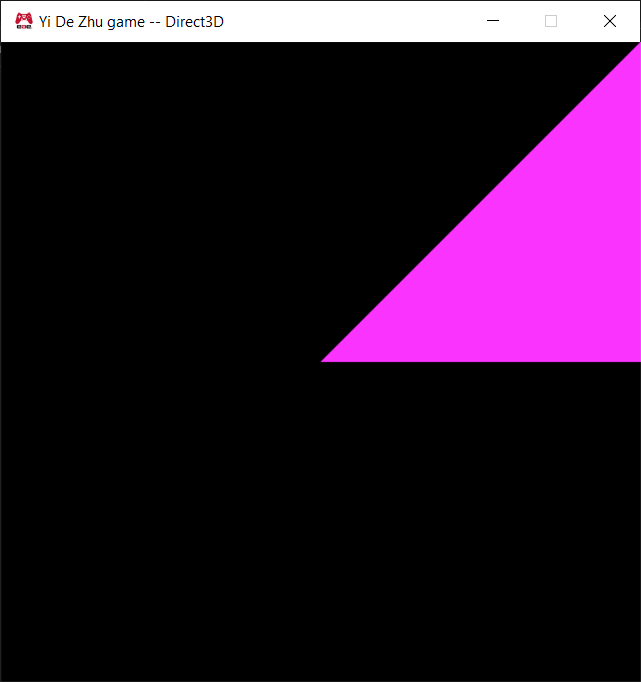

Download Link: https://codeload.github.com/ZHU-MONEY/EAE-6320/zip/refs/heads/Assignment_01_file

Projects that needed Graphics as reference:
-	Application
-	ExampleGame
-	MyGame
-	ShaderBuilder

The code base is easily enough to understand, but there is a big issue, it is simply too old and description isn’t complete, people were getting stuck because of their different approach to the work description. In other words, everybody followed the description step by step, but still few people would get stuck due to different reference issues.
The issue I ran into was the data folder in the output was not getting built, because there is a reference issue that is not described in the assignment, and I had fell for it due to my way of building the solution.
You need to Build the solution first, then Debug. If you clicked on Debug without a build, the automatic build that happens before the Debug, would cause the data folder not to build.

I would like to learn more about how to build an application with complicated system with API interacting with each other. My endgoal is to become a backend developer. 
