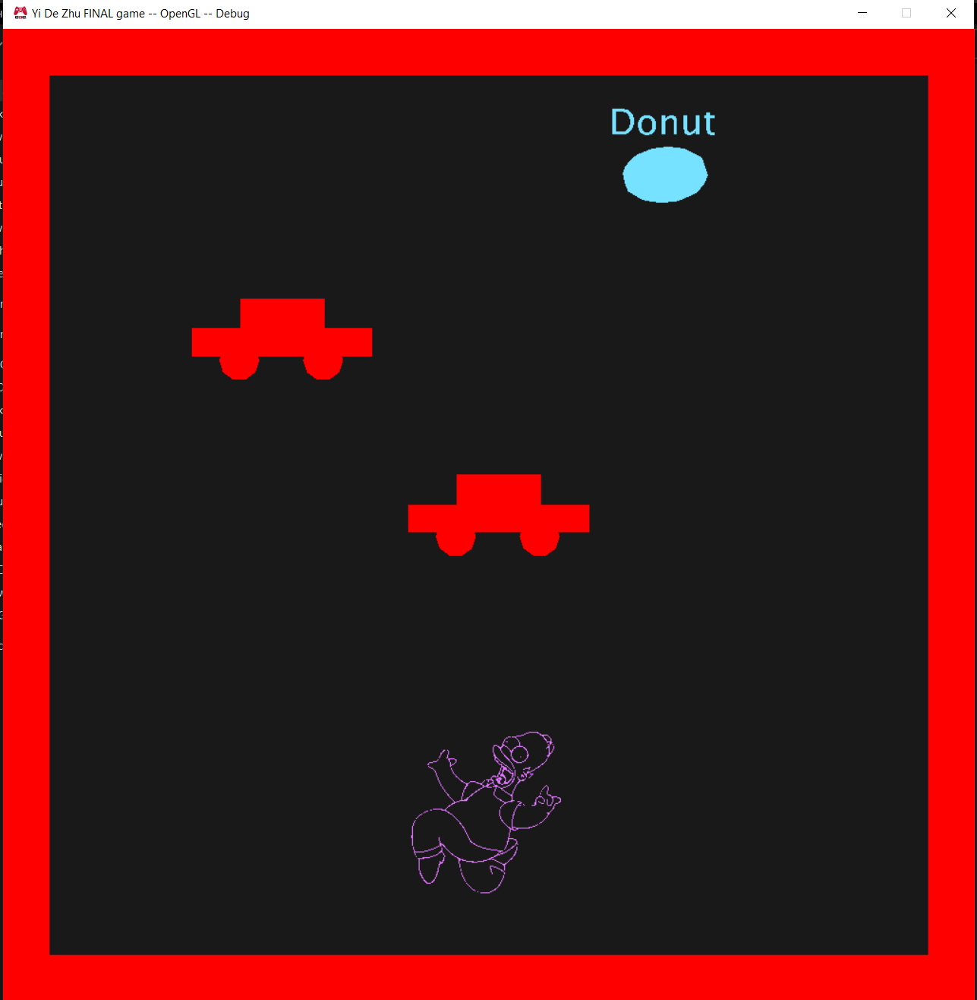
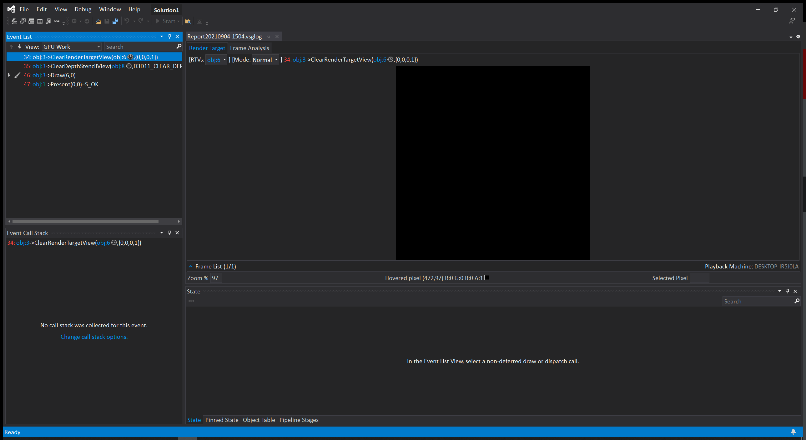
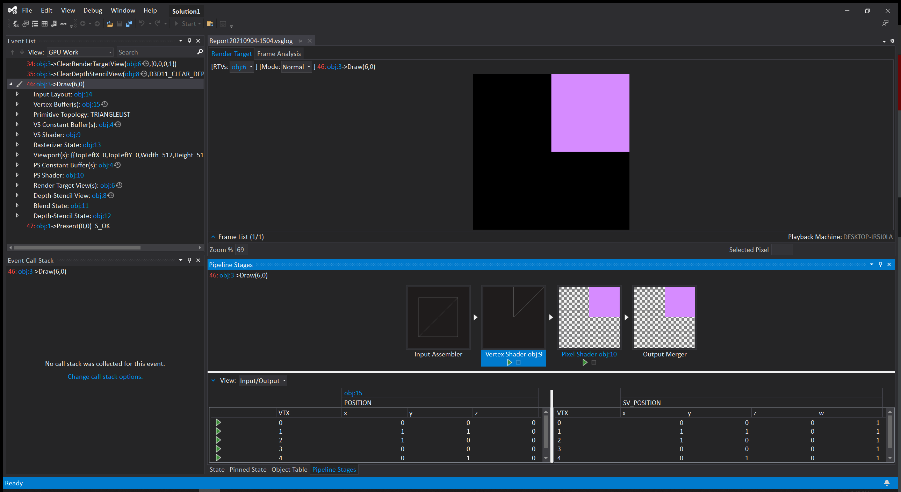
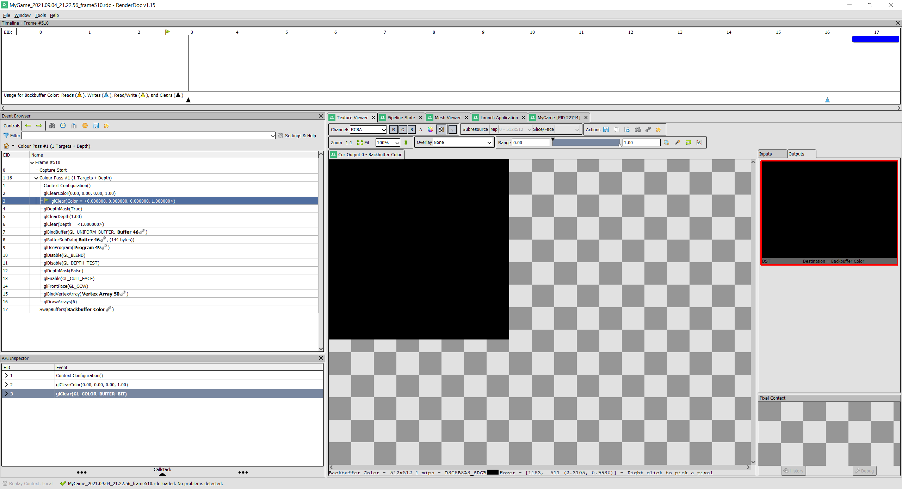
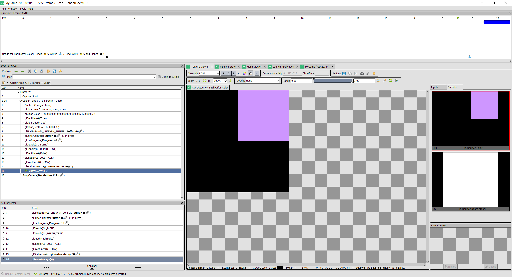
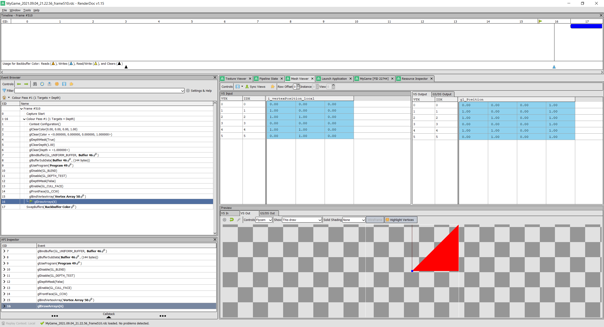
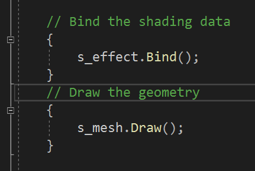

Download: https://github.com/ZHU-MONEY/EAE-6320/archive/refs/heads/Assignment_02_file.zip

 
Direct3D GPU capture:
 
 

Open GL capture:
 
  
  
  
-	Created cMesh class and cEffect class for both D3D and GL versions
-	Moved the code associated with initialization and cleanup and draw of mesh into cMesh 
-	Moved the code associated with initialization and cleanup and bind of effect into cEffect 
-	cMesh for now doesn’t have any platform independent code, since its initialization, cleanup and draw functions are quite different between 2 platforms
-	cEffect instead have initialization and cleanup function that are platform independent – ish, the initialization and clean up is the same for both platforms, expect GL has an extra part on top of what D3D init and cleanup have, so the current solution to deal with it, is to have init and cleanup in a cEffect.cpp file but inside init and cleanup there are pieces of preprocessing code that runs only when the platform is GL
-	cEffect also has the bind function that isn’t platform independent, therefore there is a cEffect.d3d.cpp and cEffect.gl.cpp that contain bind function for corresponding platform
-	The vertices and the number of triangles is currently hard coded into the cMesh.cpp, so to add a new triangle, just change the number of triangles from 1 to 2, and add 3 new vertices to the array, the order of vertices in the array matters, since GL and D3D read things differently

