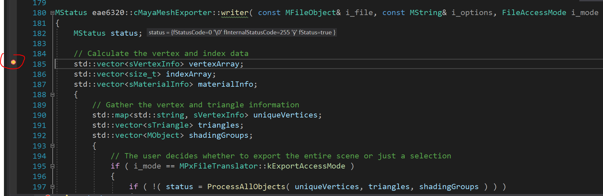

Download: https://github.com/ZHU-MONEY/EAE-6320/archive/refs/heads/Assignment_07_file.zip

WASD to the camera

Up Down Left Right keys to move the game object 

The MayaMeshExporter project only needs reference of Windows and no other projects depends on MayaMeshExporter, because it is simply building a plug-in for an external non-engine related tool to use and not the engine.
I only exported the vertex data and index data because I want to keep things simple to read and parse.

Debug screenshot:

If the exported mesh contains too many vertices (more than 100000), it will log an error and load a default triangle mesh (very cheap), without crashing the program or throw.
