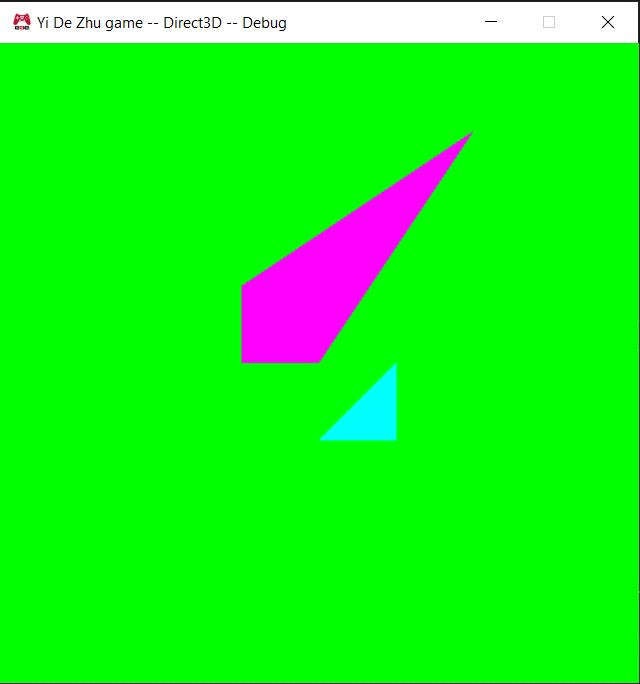
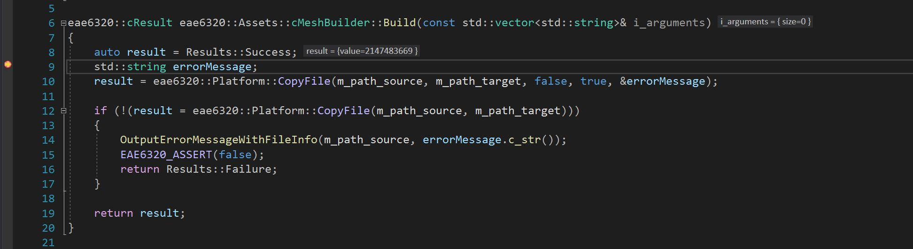

Download: https://github.com/ZHU-MONEY/EAE-6320/archive/refs/heads/Assignment_06_file.zip
WASD to the camera
Up Down Left Right keys to move the game object 

The purpose of having the human readable asset file:
-	We are human
-	It is a lot easier to manually change data when it is necessary, for example during testing and debugging
Mesh file format example:
return
{
    vertexData =
    {
        {0, 0, 0},
        {3, 3, 0},
        {1, 0, 0},
        {0, 1, 0}
    },

    indexData =
    {
        0, 1, 2, 0, 3, 1
    }
}

I wanted to keep things very simple and clean, one vertexData array that contains Vector3s and one indexData array that contains the index order, nothing else.

Debug screenshot:

