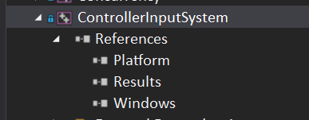
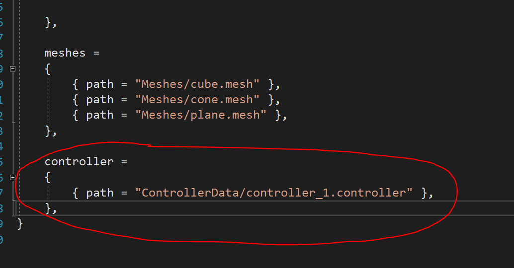
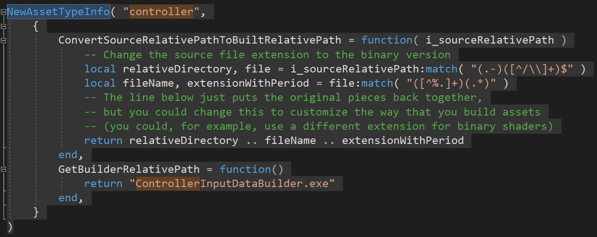
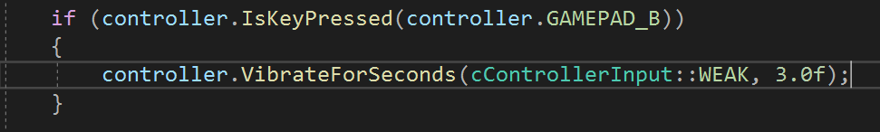
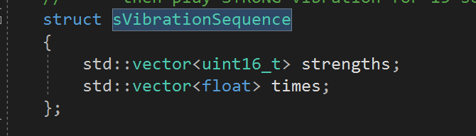
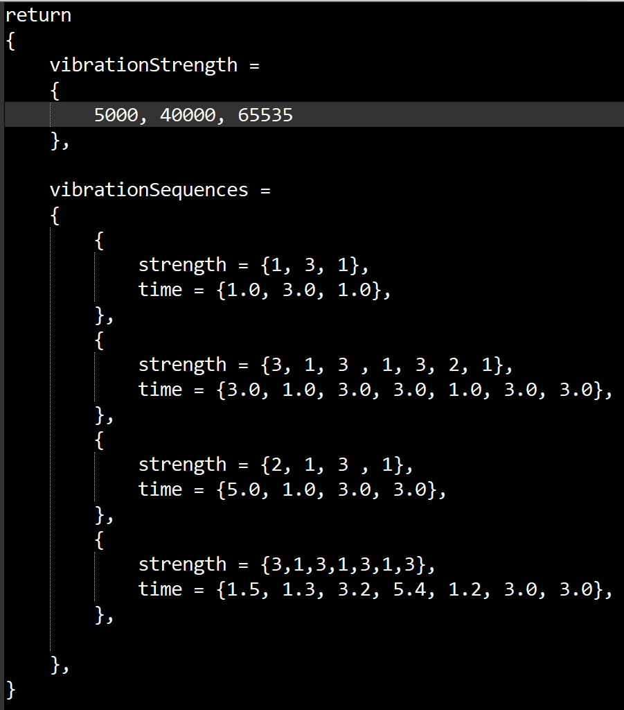

ControllerInputSystem

Download: https://github.com/ZHU-MONEY/EAE-6320/archive/refs/heads/Controller_Input_System.zip

The zip file includes:
-	Project ControllerInputSystem
-	Project ControllerInputDataBuilder
-	Sample LUA controller data file “controller_1.controller”
This controller input system allows the user to add XBOX controller input for their game/engine, in addition to that, the user can also customize vibration strength and vibration sequence via LUA based data file.
******This system only support 1 XBOX controller
To use the system:
-	Add ControllerInputSystem to Engine
-	Add ControllerInputDataBuilder
-	Add property sheets for both projects
-	Add dependencies for both projects as shown below

-	Add the code below to AssetToBuild.lua

-	Add the code below to AssetBuildFunctions.lua, under the same code which you did for the mesh in previous assignment

-	Add the provided sample “controller_1.controller” LUA file to MyGame_\Content\ControllerData
-	Initialize the controller system by calling cControllerInput::Load("data/ControllerData/controller_1.controller");
-	Update the controller system with time by calling cControllerInput::Update(i_elapsedSecondCount_sinceLastUpdate);
-	Mapping function calls to key press or analog inputs of the controllers, which I will explain below
-	Compile and run
-	Remember to manually turn on the controller

Mapping functions to controller input:

First, a little bit of explanation.

There are 2 types of input for the controller, there is the digital and there is analog. Digital inputs are the buttons and would only return TRUE or FALSE, while the analog inputs are the thumbstick and the triggers which would return a number that indicates “how” has the trigger/thumbstick been pushed/pulled.
To check whether if a button is pressed during a frame you should call:

IsKeyPressed(eButtonCode i_code);

The enum you should pass in, is the enum already defined in the cControllerInput.h, it represents each digital input button present on the controller
To check how far the analog has been pushed you should call:

**this is an example for Right Trigger

GetRightTriggerState();

GetNormalizedRightTriggerState();

GetRightTriggerState return the raw input, which is a short number ranging from 0 to 255 that represent how far the trigger has been pulled

While GetNormalizedRightTriggerState return the percentage of how far it has been pulled, which is a float number ranging from 0.0f to 1.0f

As for the thumbsticks, they work similarly, you can get both the raw input and the normalized input

Here is an example of how I used mapping:

This piece of code is inside MyGame UpdateSimulationBasedOnInput() function

Customize vibration data:

As mentioned before, you can customize level of the strength of vibrations, my original system has 3 levels, which are represented by enum eVibrationStrength.

I set it to have 3 levels is simply because having more sub levels is hard to perceive the difference by the players, while having just 3 levels is my personal preference, but if you wish to add more levels, just ask me on Slack.
The original 3 levels are WEAK = 1, MEDIUM = 2, STRONG = 3

The strength of vibration that the controller receive is just an uint16_t ranging from 0 to 65535

By defining the values of 3 levels of strengths in LUA file, you can call the vibration function with the eVibrationStrength enum instead of passing in uint16_t value.
The function you call for vibration are these:

Vibrate(uint16_t i_vibrationStrenght);

Vibrate(eVibrationStrength i_vibrationStrenght);

VibrateForSeconds(eVibrationStrength i_vibrationStrenght, float i_seconds);
 
VibrateForSeconds(uint16_t i_vibrationStrenght, float i_seconds);

The each vibration function require the strength to be passed in, users are recommended to use the eVibrationStrength instead of raw uint16_t value.

Vibrate() would vibrate the controller for 1sec with the corresponding strength

VibrateForSeconds() would vibrate the controller for the time the user pass in as parameter with the corresponding strength

There is also a VibrateSequence(size_t index) function that would vibrate the controller based on a sequence of vibration

The sequence is a struct sVibrationSequence, which contains 2 std::vector

For example if a sVibrationSequence is defined as:

strengths = {1,3,2,1}

times = {3.0f, 5,0f, 1.5f, 15.0f}

this means play WEAK vibration for 3 sec,
then play STRONG vibration for 5 sec,
then play MEDIUM vibration for 1.5 sec,
then play STRONG vibration for 15 sec

This type of sequences is stored inside vector called customSequences, and by calling VibrateSequence(size_t index) and passing in the index of the sequence, you can play the sequence stored inside the vector.

To customize the vibration strength and sequences, you need to modify the LUA controller data file.
This is the sample LUA file:

The 3 numbers in the vibrationStrength table represent the value for eVibrationStrength enum, in this case: WEAK is 5000, MEDIUM is 40000, STRONG is 65535

Inside the vibrationSequences table are each vibration sequence, they will be loaded into sVibrationSequence struct and saved into the customSequences vector one by one at initialization, you can customize as many sequences as you wish. 

Since I only have 3 strengths levels, in the vibration sequence strength, they must be 1 or 2 or 3. Otherwise, it would not vibrate for the specified time.

Anything interesting thing I have learned:

-	Once you write enough code, VS IDE intelliSense and autocompletion just stop working, restart fixes it
-	None
Any struggle I have encountered:
-	Finding a good way to design the encoder and decoder for the controller LUA file
-	Reading LUA is too wordy and complicated, should have used JSON since there are widely used libraries that support reading JSON in an easy way 
-	Not enough sleep
-	Prolonged coding session induces back pain and forearms numbness
