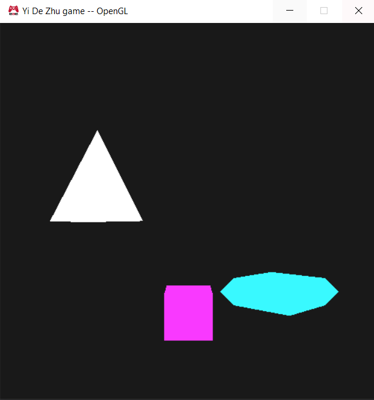
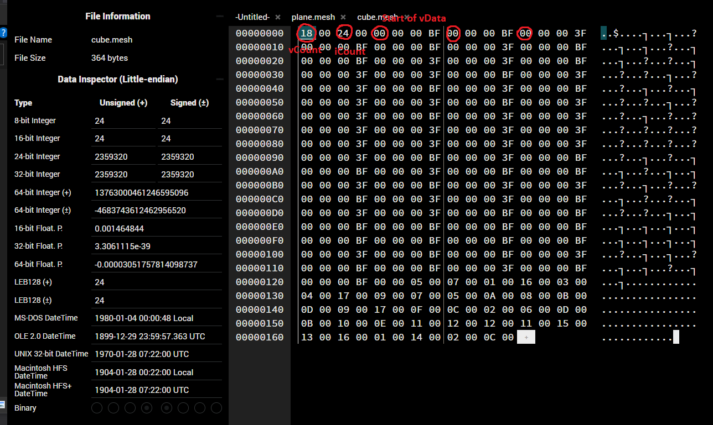
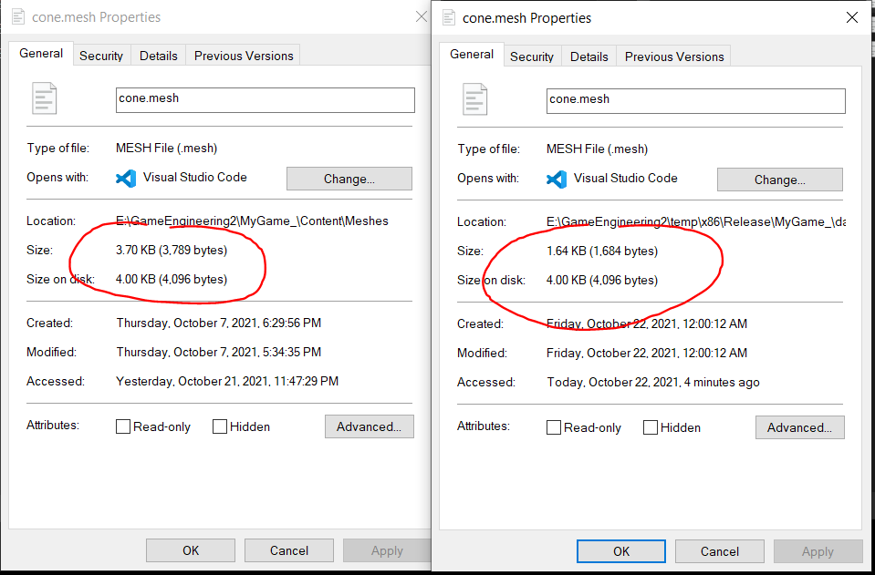
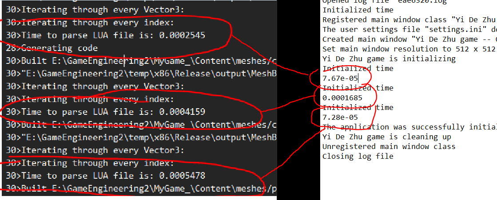
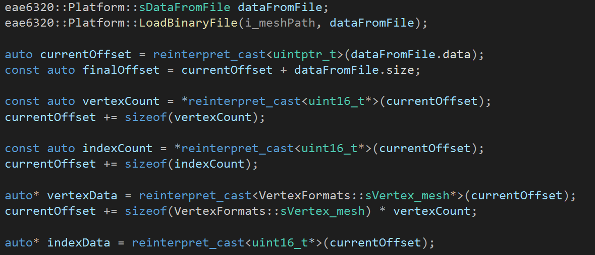

Download: https://github.com/ZHU-MONEY/EAE-6320/archive/refs/heads/Assignment_08_file.zip

WASD to the camera

Up Down Left Right keys to move the game object 

This is an example of what a binary geometry file looks like, this is a cube. The order of which things are stored are: vetexCount, indexCount, vertedData[], indexData[]. I ordered the data to be stored this way is because when trying to extract the data, having the count first is going to be easier to calculate the offset for extracting the array later. 
The vertexCount and indexCount are spaced in 2 because they are uint16_t which are 2 bytes and the array values are spaced by 4 because they are float which are 4 bytes.

The advantage of using binary file are 2:
-	The file size is smaller
-	It is quicker to load

Here are the comparisons:
The left is the LUA human readable file, while the right is the binary file of the same geometry mesh

****Time are in seconds
We can clearly see from the pictures shown, the binary file is just lighter and faster

The reason we use Human readable is source control is simply because: it is human readable

And we use binary file during run time is because: faster and lighter, and the machine isn’t human

The binary file is the same for both x32 and x64 versions, because it is just the representation of a set of data in binaries. It is the machine’s job to read them in the way they need. (Separation of concern)

This is how I extracted the data from binary file

