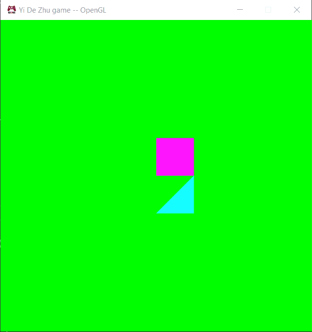

Download: https://github.com/ZHU-MONEY/EAE-6320/archive/refs/heads/Assignment_04_file.zip

Controls:	

Space – Show one mesh less

Tab – Change the shader for one mesh

Esc – E
          

The reason we submit data to the cache instead of drawing them immediately is for stability. The Graphics may render when the data are not filled yet due to concurrency. And there might be unexpected behavior which is unwanted. 
D3D mesh and effect size:

GL mesh and effect size:

For the mesh, I removed 2 unnecessary members:
-	Unsigned int s_vertexCountPerTriangle
-	Unsigned int s_indexCount
Therefore, mesh would be smaller than the last time, for d3d, it is 16 bytes smaller and for GL is 8 bytes smaller.
With new reference count member, for both mesh and effect, d3d adds 8 bytes, and GL adds 4 bytes
Can’t make mesh or effect any smaller at this point

As for the size of data cache:
D3D:

GL:

