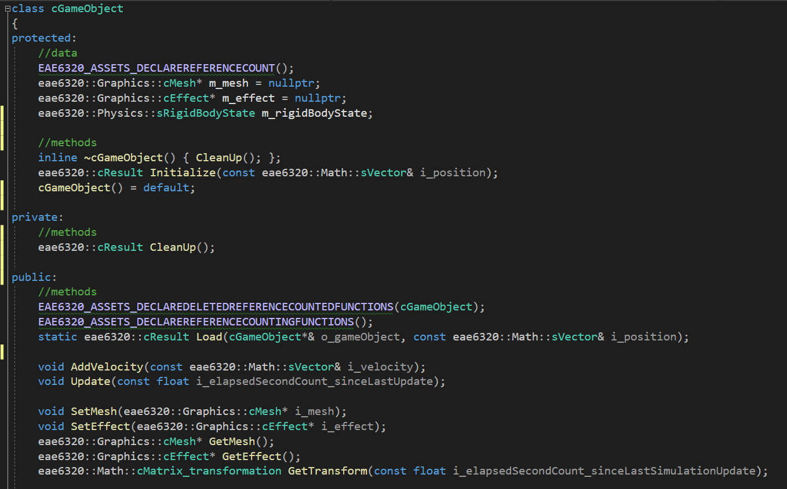

Download: https://github.com/ZHU-MONEY/EAE-6320/archive/refs/heads/Assignment_05_file.zip
WASD to the camera
Up Down Left Right keys to move the game object 

The game object class would need a renderable part that is a mesh and an effect pair, plus it would need a coordinate system that is the rigid body state, which contains the physics for movement and location, rotation, orientation.

GL size:

D3D size:

extrapolation/prediction is necessary to prevent jerky movement which can be caused by different update time for 2 system, so the render system may lag behind the physics simulation
