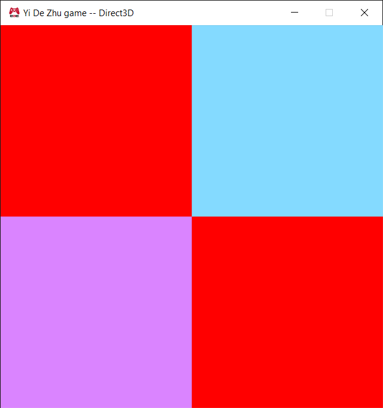
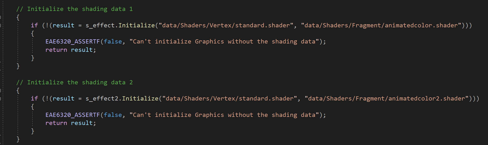

Download: https://github.com/ZHU-MONEY/EAE-6320/archive/refs/heads/Assignment_03_file.zip

In order to make the Graphics platform independent I had to add a View class for both D3D and GL and remove the Graphics.gl.cpp and Graphics.d3d.cpp, everything that was handled by the platform specific code in Graphics.cpp is now processed by the View class
The view class takes care of swap and clear buffer, since the GL doesn’t need to explicitly init and clean up a view object, the init and cleanup for GL just returns a Results::Success without doing anything else

To init an effect, it would need a path to the vertex shader and a fragment shader, for now, the path is hardcoded in the Graphics.cpp when the effect is initialized

To init a mesh, it would need vertex array, an index array that contains the order of how to draw the mesh, it would also need to input the amount of vertex, and amount of triangles
**The vertex data array must be in d3d clockwise order, the GL has a specific function in Mesh class that would convert it to GL counterclockwise order during init

D3D mesh and effect size:

GL mesh and effect size:

Generally speaking, D3D data sizes would be larger than the GL version because of its 64x platform which the pointers are 8 bytes, while in GL, the pointers are 4 bytes
Meshes are of 40 and 24 size, but it can be shrunk down to 32 and 16 by omitting these in the Mesh property:
    1-	unsigned int s_vertexCountPerTriangle   ---4 bytes
    2-	either (unsigned int s_triangleCount) or (unsigned int s_indexCount)   ---4 bytes 
I have decided to have them as property, because it is my design choice, for now.

Explanation for the sizes:

- GL Mesh: 3*(4 bytes for platform dependent GLuint) + 3*(4 bytes for platform independent unsigned int)

- GL Effect: 1*(4 bytes for platform dependent GLuint) + 2*(4 bytes for platform independent Shader pointer) + 1 byte for unit8_t inside render state, the rest I cannot explain

- D3D Mesh: 3*(8 bytes for platform dependent 2 Buffer pointers and 1 VertexFormat pointer) + 3*(4 bytes for platform independent unsigned int) + the rest I can’t explain, the view maybe? View has 2 pointers, however that is 8bytes*2

- D3D Effect: 2* (8 bytes for platform independent Shader pointer) + 3*(8 bytes pointers inside render state + 1byte for unit8_t inside render state
